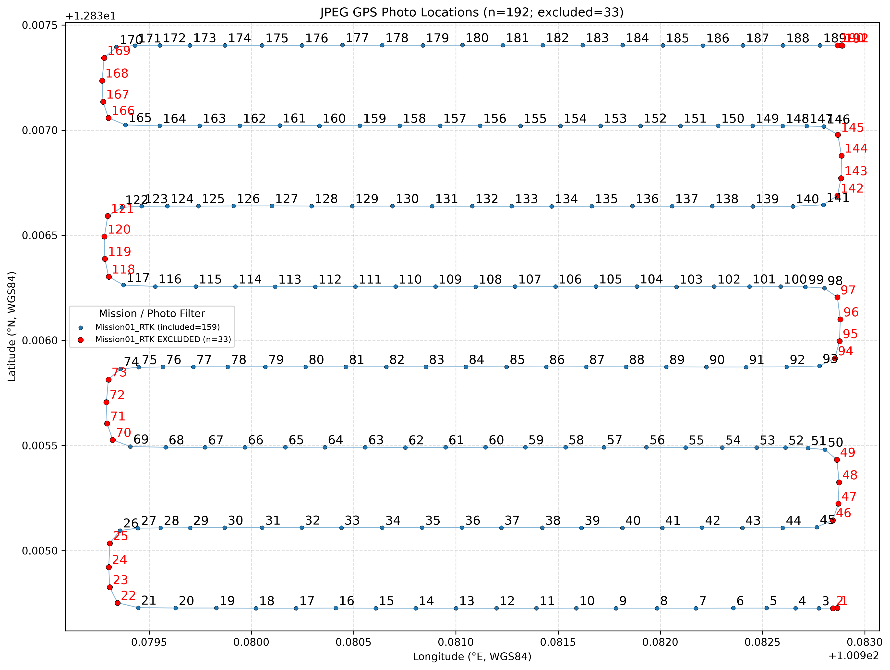
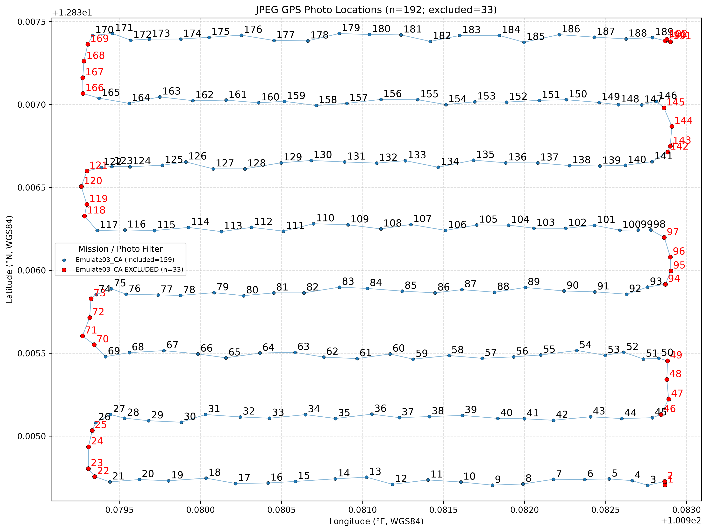

# 2026-UAV_Training

## UAV Photo Trajectories

Comparison of UAV photo locations extracted from embedded EXIF GPS metadata.

| Mission 01 — RTK | Emulate 03 — CA |
|:---:|:---:|
|  |  |
| [View RTK plot](Mission01_RTK_filtered/photos_gps.png) | [View CA plot](Emulate03_CA_filtered/photos_gps.png) |
